# Partners Portal - Workflow Diagram

## System Architecture Flow

```mermaid
graph TB
    User[👤 User/Affiliate] --> Frontend[🌐 Frontend<br/>partners.addaeducation.com<br/>React + Vite]
    Admin[👨‍💼 Admin] --> Frontend
    
    Frontend -->|API Calls| Backend[⚙️ Backend API<br/>api.partners.addaeducation.com<br/>Python FastAPI]
    
    Backend -->|Read/Write| DynamoDB[(📊 AWS DynamoDB<br/>Users, Links, Analytics)]
    Backend -->|Fetch Templates| AppTrove[🔗 AppTrove API<br/>Link Management]
    Backend -->|Get Stats| AppTrove
    
    Frontend -->|Static Files| CDN[📦 Static Assets<br/>health.json]
    
    style Frontend fill:#4A90E2,color:#fff
    style Backend fill:#50C878,color:#fff
    style DynamoDB fill:#FFA500,color:#fff
    style AppTrove fill:#9B59B6,color:#fff
```



## Affiliate Approval Workflow


## Link Creation & Tracking Flow


## Data Flow Architecture


## Health Check Flow


## Deployment Architecture


## User Journey - Affiliate Onboarding


## API Request Flow

```mermaid
flowchart TD
    Request[HTTP Request] --> CORS{CORS Check}
    CORS -->|Allowed| Auth{Authentication}
    CORS -->|Blocked| Error1[403 Forbidden]
    
    Auth -->|Valid| Route{Route Handler}
    Auth -->|Invalid| Error2[401 Unauthorized]
    
    Route -->|GET /api/users| UsersHandler[Users Handler]
    Route -->|POST /api/users/{id}/approve| ApproveHandler[Approve Handler]
    Route -->|GET /api/apptrove/templates| TemplatesHandler[Templates Handler]
    Route -->|GET /api/dashboard/stats| StatsHandler[Stats Handler]
    
    UsersHandler --> DynamoDB[(DynamoDB)]
    ApproveHandler --> DynamoDB
    TemplatesHandler --> AppTrove[AppTrove API]
    StatsHandler --> DynamoDB
    
    DynamoDB --> Response[JSON Response]
    AppTrove --> Response
    Response --> Client[Client Receives Data]
    
    style Request fill:#4A90E2,color:#fff
    style Response fill:#50C878,color:#fff
    style Error1 fill:#FF6B6B,color:#fff
    style Error2 fill:#FF6B6B,color:#fff
```

---

## Diagram Formats

These diagrams use **Mermaid** syntax and can be rendered in:
- GitHub markdown files
- GitLab markdown
- VS Code with Mermaid extension
- Online at https://mermaid.live

## Key Components

1. **Frontend:** React SPA served from `partners.addaeducation.com`
2. **Backend:** FastAPI REST API at `api.partners.addaeducation.com`
3. **Database:** AWS DynamoDB for persistent storage
4. **External:** AppTrove API for link management and tracking
5. **Deployment:** Docker container on AWS EC2
